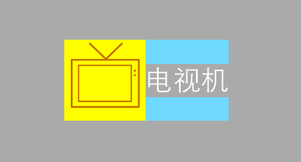
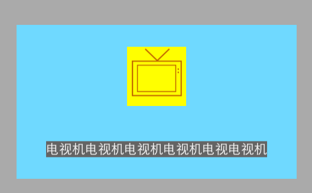
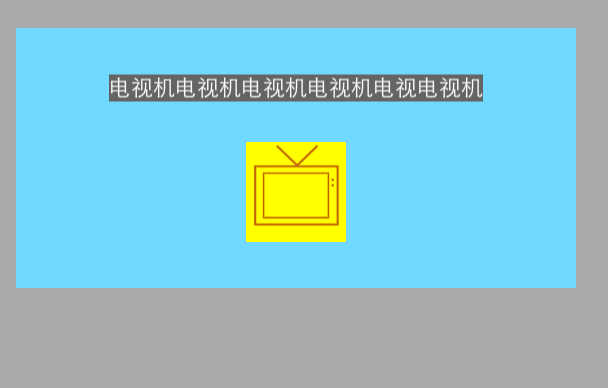
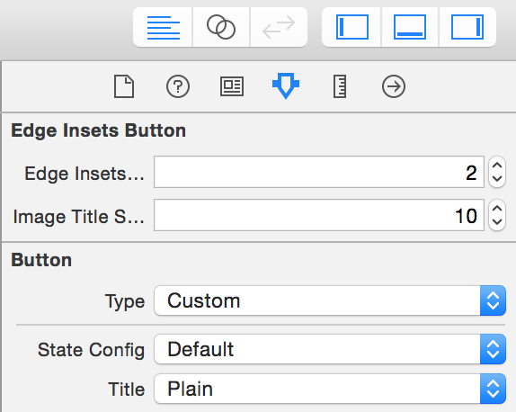
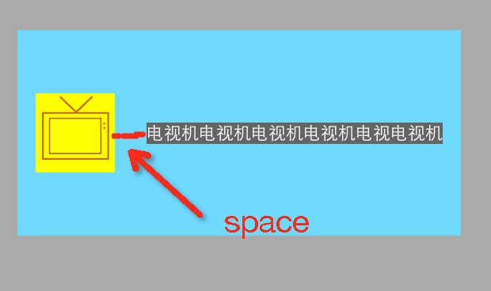
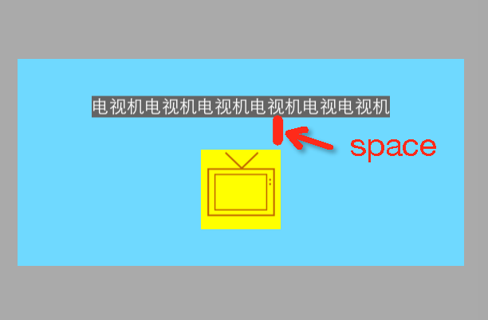

# UIButtonEdgeInsets
通过类别和继承方式实现按钮的图片和标题布局，调整 UIButton的imageEdgeInsets 和titleEdgeInsets属性

### 按钮布局结构

### 两种方式实现按钮图片标题的布局

### (一) 使用 HYEdgeInsetsButton （UIButton子类）
	使用代码或者在Interface Builder调整 edgeInsetsStyle (HYButtonEdgeInsetsStyle 枚举) 和 imageTitleSpace (CGFloat) 两个属性

    // edgeInsetsStyle
	typedef NS_ENUM(NSUInteger, HYButtonEdgeInsetsStyle) {
    HYButtonEdgeInsetsStyleImageLeft,
    HYButtonEdgeInsetsStyleImageRight,
    HYButtonEdgeInsetsStyleImageTop,
    HYButtonEdgeInsetsStyleImageBottom
	};	
	
	// imageTitleSpace 为图片标题间距

#### Interface Builder 调整

	
### (二) 使用 类别 UIButton+EdgeInsets 
	- (void)layoutButtonWithEdgeInsetsStyle:(ButtonEdgeInsetsStyle)style imageTitlespace:(CGFloat)space;
	
	// style
	typedef NS_ENUM(NSUInteger, ButtonEdgeInsetsStyle) {
    ButtonEdgeInsetsStyleImageLeft,
    ButtonEdgeInsetsStyleImageRight,
    ButtonEdgeInsetsStyleImageTop,
    ButtonEdgeInsetsStyleImageBottom
	};
	
	// space为图片标题间距

	
